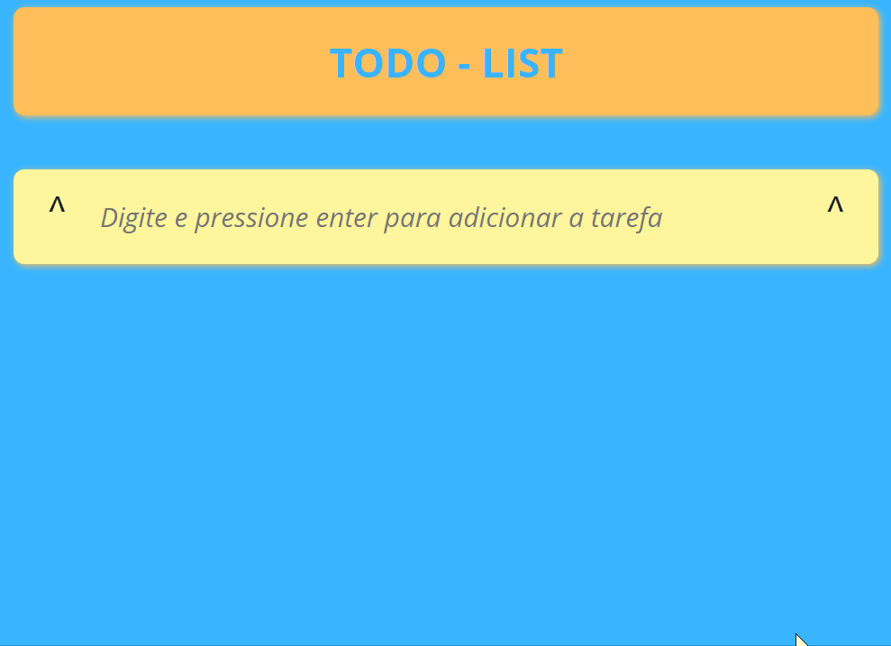

# Lista-de-tarefas
Este projeto foi criado com o intuito de colocar em prática meus os conhecimentos adquiridos em JavaScript. A ideia inicial é desenvolver um Todo List ir acrescentando recursos à medida que avanço com meus estudos.

# Tecnologias-ultilizadas
- HTML/CSS/JAVASCRIPT

# O-Projeto
